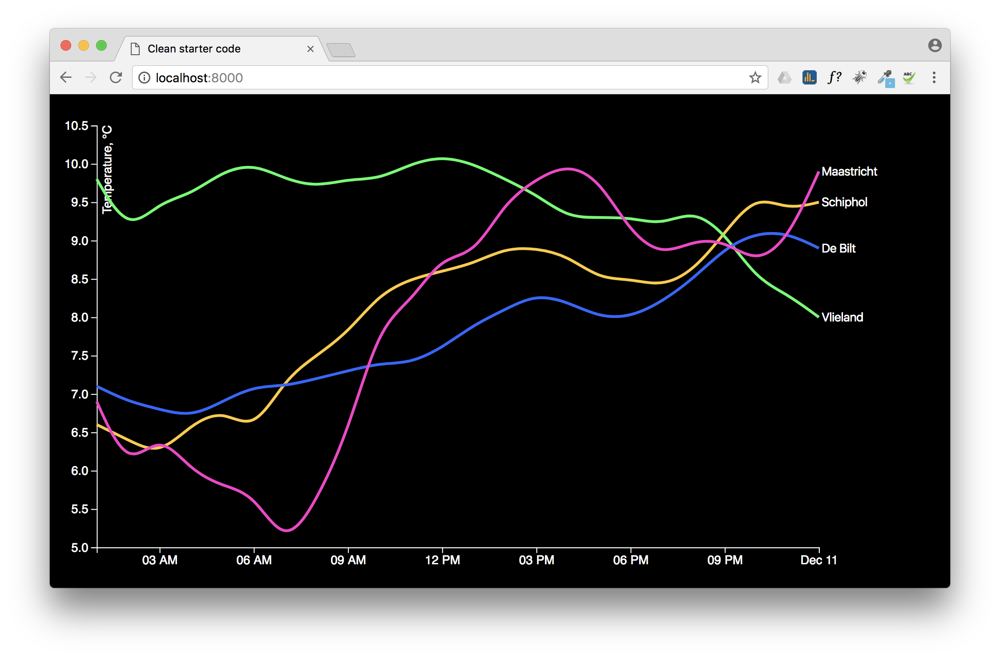

# Class 3 - Assignment 1 - Clean

## Short description
A assignment done for the Front End 3 course at the Hogeschool van Amsterdam. This assignment was all about cleaning up your given data to make a visualisation. Most of the code was written by my teacher, [@wooorm](https://github.com/wooorm).

## How did I do it?
First I went through the [slides](https://docs.google.com/presentation/d/1TpoPilc1qVIQU07u_IdPeNqSZcbgliPaLF0zZUWGvWE/edit?usp=sharing) of our third class to refresh my memory. After using some of the code I got stuck and asked a classmate what he had done, he then informed me about d3.nest and helped me to finish up the assignment.

## Data used
I used data from the [KNMI](http://projects.knmi.nl/klimatologie/uurgegevens/selectie.cgi) website, the assignment stated that I needed four data sets, I did switch at the end cause some of the data gave back no temperature. 
* [Maastricht](http://www.knmi.nl/samenw/klimatologie/metadata/maastricht.html',800,794)
* [Schiphol](http://www.knmi.nl/samenw/klimatologie/metadata/schiphol.html',800,794)
* [De Bilt](http://www.knmi.nl/samenw/klimatologie/metadata/debilt.html',800,794)
* [Vlieland](http://www.knmi.nl/samenw/klimatologie/metadata/vlieland.html',800,794)

## Code used
Most of the cleaning data part (removing stuff) I learned and 'copied' from the [slides](https://docs.google.com/presentation/d/1TpoPilc1qVIQU07u_IdPeNqSZcbgliPaLF0zZUWGvWE/edit?usp=sharing) of our third class. After that was done I used a couple of links found on the internet to better understand the nesting that had to be done. Two I found really helpfull were;
* [Learn JS data, group data through nesting](http://learnjsdata.com/group_data.html)
* [Youtube video for better understanding](https://www.youtube.com/watch?v=6dcj3X6Bfsk)

## License
Copyright (c) 2017 [@tiicotaco](https://github.com/tiicotaco)
