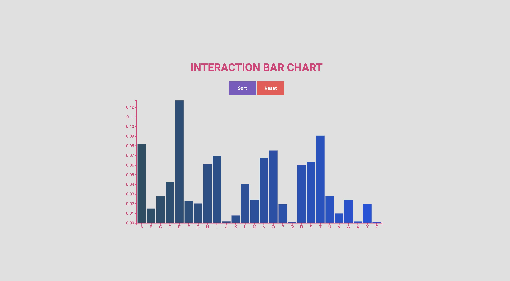

# Interaction
This is a D3 chart of visualsing the percentage to the letters. This assignment is made with [D3](https://d3js.org/). I've chosen the [Bar chart](https://bl.ocks.org/d3noob/bdf28027e0ce70bd132edc64f1dd7ea4) to visualise my data. You can select two buttons to sort out the data from high to low percentage.



## Background
First of I copied the files from the original [Bar chart]. After that I've made a directory with the following files:

* 'index.html', This is basically the file that's being show in the browser.
* 'index.css', Stylesheet.
* 'index.js', Here is where the animations and the data is being loaded in.
* 'index.csv', This is the data.

### index.html
I've added a '<main>' and '<div>' to the file. The '<main>' I used for the CSS later on added the '<div>' tag for the '<buttons>' to sort the data on.
  
### index.css
In the index.css file I've positioned the body so that it's centered in the middle of the browser. To the '<main>' I've added 

### index.js
I've changed the code so that the svg it is being loaded into the HTML file:
```javascript
var svg = d3.select("body").append("svg")
  .attr("width", width + margin.left + margin.right)
  .attr("height", height + margin.top + margin.bottom)
  .append("g")
  .attr("transform",
    "translate(" + margin.left + "," + margin.top + ")");
``` 

The "width" and "height" is coming from the global variables:
```javascript
var margin = {
    top: 20,
    right: 20,
    bottom: 30,
    left: 40
  },
  width = 960 - margin.left - margin.right,
  height = 500 - margin.top - margin.bottom;
```

After that I looked into the examples of Titus. I took some code from the example and changed it a bit:
```javascript
function onchange() {
    var sort = this.checked ? sortOnFrequency : sortOnLetter;
    var x0 = x.domain(data.sort(sort).map(letter)).copy();
    var transition = svg.transition();

    timeout.stop();

    svg.selectAll('.bar').sort(sortBar);

    transition.selectAll('.bar')
      .delay(delay)
      .attr('x', barX0);

    transition.select('.axis-x')
      .call(d3.axisBottom(x))
      .selectAll('g')
      .delay(delay);

    function sortBar(a, b) {
      return x0(letter(a)) - x0(letter(b));
    }

    function barX0(d) {
      return x0(letter(d));
    }

    function delay(d, i) {
      return i * 50;
    }
  }

  function change() {
    d3
      .select('input')
      .property('checked', true)
      .dispatch('change');
  }

  function barX(d) {
    return x(letter(d));
  }

  function barY(d) {
    return y(frequency(d));
  }
}

function row(d) {
  d.frequency = Number(frequency(d));
  return d;
}

function sortOnFrequency(a, b) {
  return frequency(b) - frequency(a);
}

function sortOnLetter(a, b) {
  return d3.ascending(letter(a), letter(b));
}

function letter(d) {
  return d.letter;
}

function frequency(d) {
  return d.frequency;
}
```

To this:
```javascript
d3.select("#reset").on("click", reset);
  
  function reset() {
    var axisX = x.domain(data.sort(sortLetter).map(letter)).copy();
    var transition = svg.transition();
 
    transition.selectAll('.bar')
      .delay(delay)
      .attr('x', barX);

    transition.select('.axis-x')
      .call(d3.axisBottom(x))
      .selectAll('g')
      .delay(delay);

    function barX(d) {
      return axisX(letter(d));
    }

    function delay(d, i) {
      return i * 10;
    }
  }

function sortPercentage(a, b) {
  return d3.ascending(percentage(b), percentage(a));
}

function percentage(d) {
  return d.percentage;
}

function sortLetter(a, b) {
  return d3.descending(letter(b), letter(a));
}

function letter(d) {
  return d.letter;
}
```

I've cut some code out of it and added a own function around it. I also didn't used a label, but a button. The 'transition.select('.axis-x')' I added also to the 'svg.append' for the x-axis, because then the transitions works when you are sorting the data.

### index.csv
I used the data from the example. Index.csv. It contains basic data attributes with letters. Each letter has a percentage:

* 'letter', Letters in ABCDE.
* 'percentage', How much percentage (%) the letter has.

Example:

| letter          | percentage          |
| ------------- | ------------- |
| A      | .08167        | 
| B      | .01492        |
| C      | .02782         |
| D      | .04253         |
| E      | .12702        |

## Features
* [Inspiration](https://cmda-fe3.github.io/course-17-18/class-4/sort/)
* [D3](https://d3js.org/)
* [Original Bar chart](https://bl.ocks.org/d3noob/bdf28027e0ce70bd132edc64f1dd7ea4)
* [Author](https://b.locks.org/mbostock)
* [Data KNMI](https://github.com/cmda-fe3/course-17-18/blob/master/assessment-1/temperature.csv)

## Thoughts
I used Titus example as [Inspiration] for the finsl result. I really don't know how to code this from stratch, but thanks to the example form Titus I now know a little bit more about this assignment!

## License

GPL 3.0 © 2017 Dylan van Zanten
